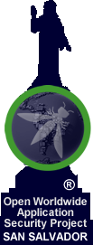

## Bienvenidos a OWASP Capitulo San Salvador

Este capitulo de San Salvador tiene como objetivo divulgar y promover las buenas prácticas vertidas en el framework OWASP
que permitan reconocer, depurar, tratar, mitigar y prevenir las vulnerabilidades tecnicas que se generan en el desarrollo de soluciones
computacionales como software, sistemas o aplicaciónes. Por lo tanto buscamos compartir conocimientos y experiencias sobre areas como:

<!-- -->
<ul style='margin-left:35px;'>
<li>Seguridad Informatica: Fisica y Logica</li>
<li>Auditoria IT y de Sistemas</li>
<li>Evaluaciones Basado en Riesgos</li>
<li>Hacking Etico</li>
<li>Aseguramiento de datos y la información</li>
<li>Forensia Informatica</li>
</ul>

Y lo realizamos a traves de actividades virtuales y fisicas como:

<ul>
<li>Charlas Informativas</li>
<li>Capacitaciones</li>
<li>Casos de Estudios</li>
<li>Talleres Tecnicos</li>
<li>Guias Practicas</li>
<li>Documentos</li>
<li>Conferencias</li>
<li>Proyectos de Estudios e Investigacion</li>
<li>Observatorio de Estadisticas Globales y Locales</li>
</ul>

Queremos contribuir para generar una concientizacion y conocimiento de las infinitas 
vulnerabilidades informaticas que existen y surgen. Por lo cual si estas interesados en unirte y compartir tu conocimientos 
sobre el mundo de la seguridad en el ambito tecnologico eres bienvenido.

## Participacion

El Proyecto de Seguridad de Aplicaciones Web Abiertas (OWASP) es una fundación sin fines de lucro que 
trabaja para mejorar la seguridad del software. Todos nuestros proyectos, herramientas, documentos, foros y capítulos son gratuitos y están abiertos
a cualquier persona interesada en mejorar la seguridad de las aplicaciones.

Los capítulos están dirigidos por líderes locales de acuerdo con la Política de Capítulos. Consultar acá: [Chapters Policy](/www-policy/operational/chapters).

 
Todos son bienvenidos y animados a participar en nuestros Proyectos [Projects](/projects/), Capítulos Locales [Local Chapters](/chapters/), Eventos [Events](/events/), Grupos en Línea [Online Groups](https://groups.google.com/a/owasp.com/){:target='_blank'} y el Canal Slack de la Comunidad [Community Slack Channel](https://owasp.slack.com/){:target='_blank'}.
Fomentamos especialmente la diversidad en todas nuestras iniciativas. OWASP es un lugar fantástico para aprender sobre seguridad de aplicaciones, 
redes e incluso para construir su reputación como experto. 

 
También lo alentamos a convertirse en miembro [become a member](/membership/) 
o considerar una donación [donation](/donate/) para apoyar nuestro trabajo en curso.
Las contribuciones financieras solo deben realizarse en línea utilizando el botón de donación en línea autorizado.

<!--
Next Meeting/Event  You should keep this section as it will populate your meetup events 
---------------------

---------------------
-->
