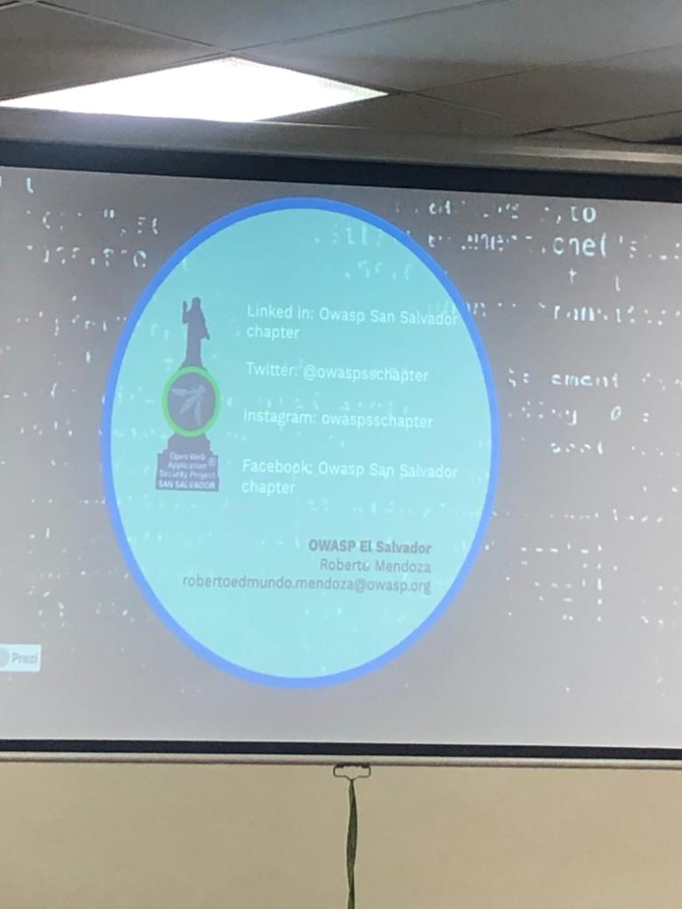
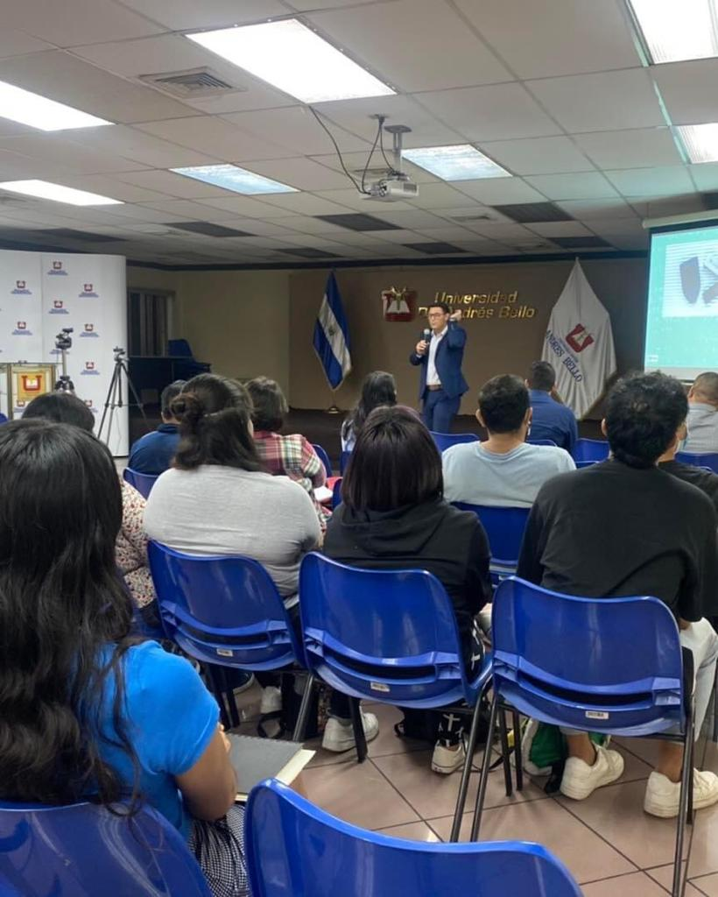

## Eventos
<!--Eventos por realizar
 
-->
<!--

<h1>En espera de informacion</h1>

-->
<!-- 

<h1>OWASP Conociendo los Activos Digitales</h1>

  
  
  
  
	
	
	

 -->

<h1>Desafios de los Activos Virtuales 15 Octubre de 2022</h1>

    

         <input class="slide-open" type="radio" id="slide-1" 
                  name="slide" aria-hidden="true" hidden="" checked="checked">
            

                    
            

         <input class="slide-open" type="radio" id="slide-2" 
                 name="slide" aria-hidden="true" hidden="">
            

                    
            

                <input class="slide-open" type="radio" id="slide-3" 
                      name="slide" aria-hidden="true" hidden="">
                

                    
                

				<input class="slide-open" type="radio" id="slide-4" 
                      name="slide" aria-hidden="true" hidden="">
                

                    
                

				<input class="slide-open" type="radio" id="slide-5" 
                      name="slide" aria-hidden="true" hidden="">
                

                    
                

				
				
				<label for="slide-5" class="slide-control prev control-1">‹</label>
                <label for="slide-2" class="slide-control next control-1">›</label>
				
                <label for="slide-1" class="slide-control prev control-2">‹</label>
                <label for="slide-3" class="slide-control next control-2">›</label>
				
                <label for="slide-2" class="slide-control prev control-3">‹</label>
                <label for="slide-4" class="slide-control next control-3">›</label>
				
				<label for="slide-3" class="slide-control prev control-4">‹</label>
                <label for="slide-5" class="slide-control next control-4">›</label>
				
				<label for="slide-4" class="slide-control prev control-5">‹</label>
                <label for="slide-1" class="slide-control next control-5">›</label>
				
                <ol class="slide-indicador">
                    <li>
                        <label for="slide-1" class="slide-circulo">•</label>
                    </li>
                    <li>
                        <label for="slide-2" class="slide-circulo">•</label>
                    </li>
                    <li>
                        <label for="slide-3" class="slide-circulo">•</label>
                    </li>
					<li>
                        <label for="slide-4" class="slide-circulo">•</label>
                    </li>
					<li>
                        <label for="slide-5" class="slide-circulo">•</label>
                    </li>
                </ol>
    

  